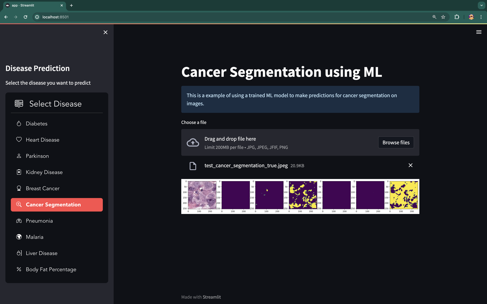
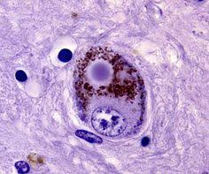
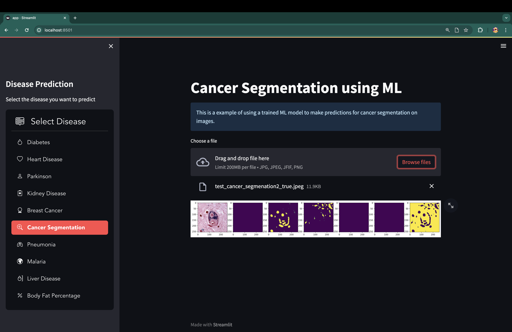
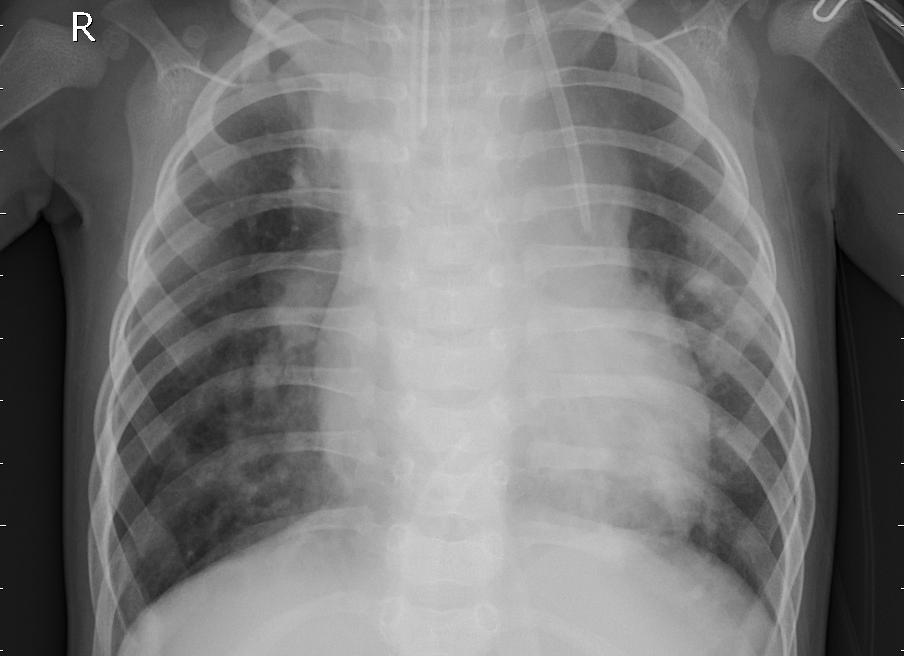
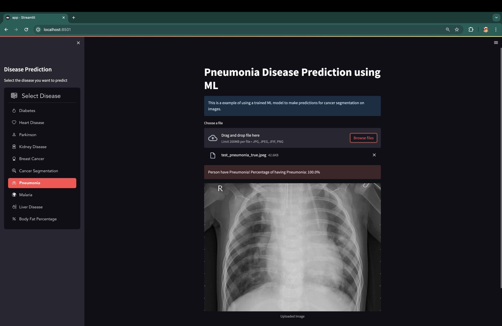
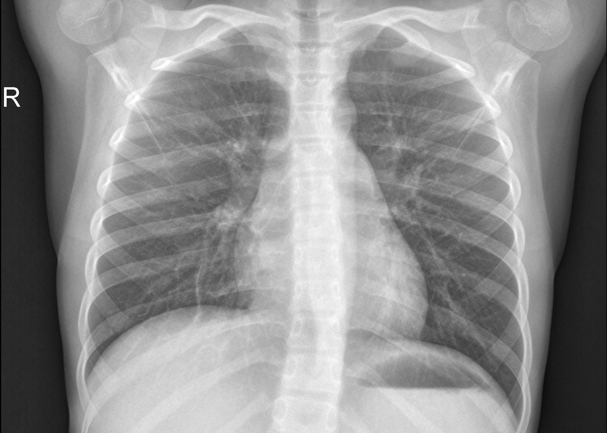
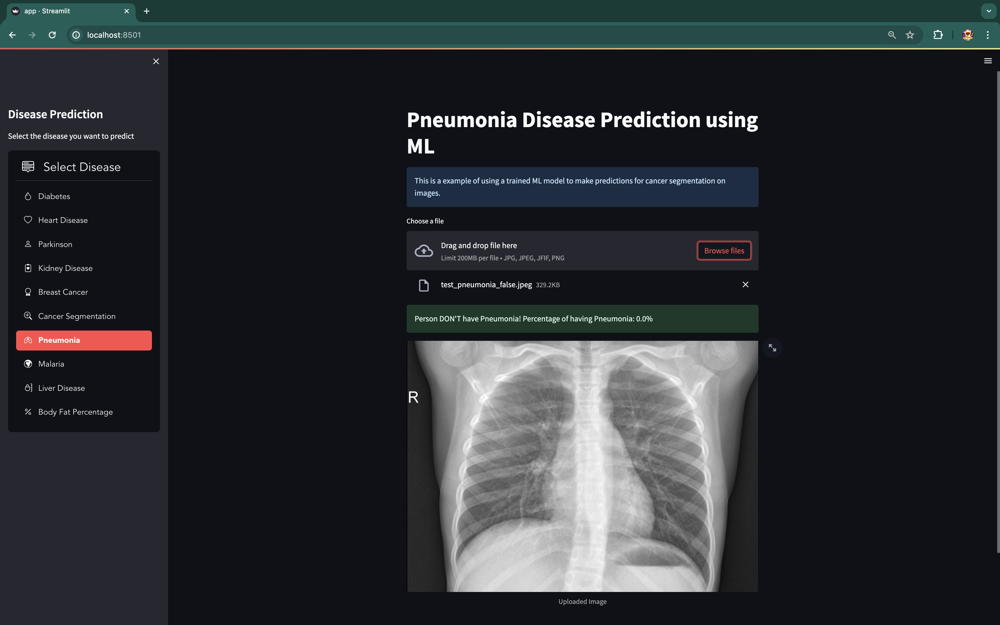
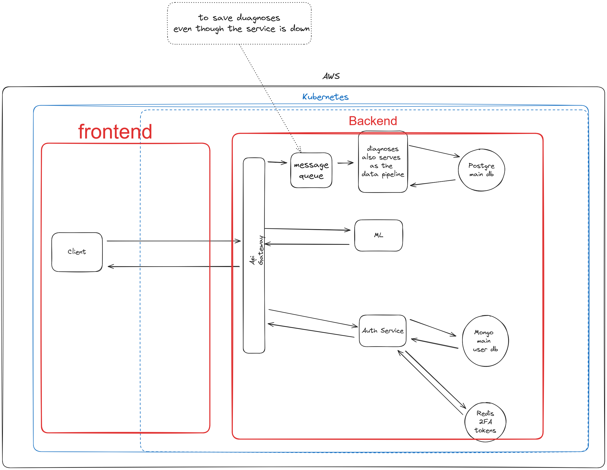
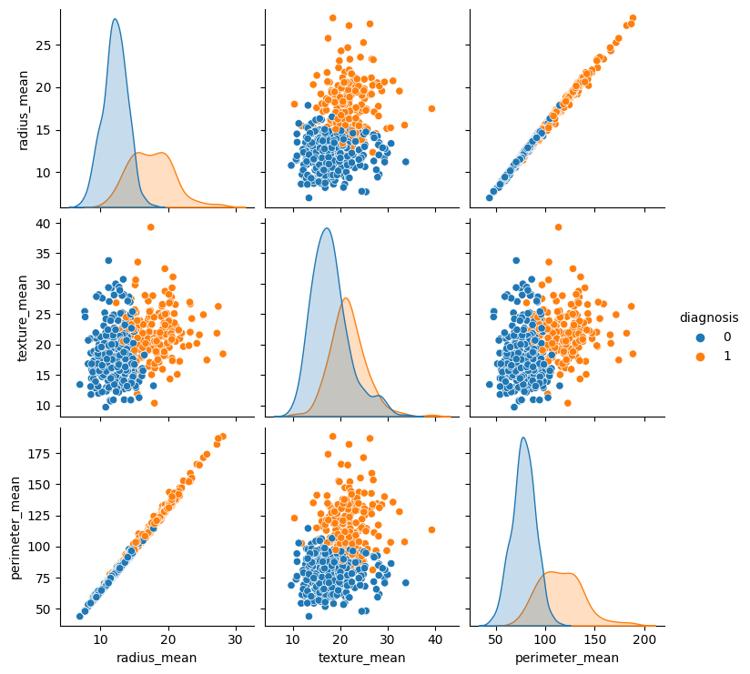

# Diagnosify

## About the project

The project "Diagnosify" represents an innovative medical system developed to facilitate doctors in the diagnostic process by providing a second opinion. Often, patients face uncertainty and the need for further consultations with various specialists due to doubts about the initial diagnosis. "Diagnosify" is created to address and solve these challenges.

Our system allows doctors to enter medical examinations of the patients, after which it uses innovative machine learning models developed by us to diagnose. These models are capable of identifying a range of diseases, including pneumonia, diabetes, skin cancer, malaria, heart and liver diseases, Parkinson's, kidney problems, and body fat percentage.

An important aspect of our system is the created communication network between doctors, which gives them the opportunity to exchange information and impressions about different cases. This not only helps in clarifying diagnoses but also contributes to the continuous improvement of the accuracy and reliability of machine learning in the system. "Diagnosify" aims to provide maximum accuracy and certainty in diagnosis, which ultimately improves the quality of medical services and patient experience.

# Diagnosify -> Cancer Segmentation

# Diagnosify -> Cancer Segmentation

# Diagnosify -> Pneumonia Detection Positive

# Diagnosify -> Pneumonia Detection Negative

## How it works

There are multiple disease categories in which you submit certain readings and they get posted into a feed where other doctors can later review. Where does ML come to play? - well
each time you submit thr form with the readings a prediction from the model is made and it shows the prediction from which the doctor could directly submit feedback whether its true or false or
send it to the feed where after a trigger has been accomplished ( for example certain numbers of votes or 1 vote) the sender will be notified and the labeled data will be sent.

# Benefits of the system

- Easy data gathering -> Since ml could help a lot in the medical field ( as it is used now ) but it suffers from lack of labeled and organized data, Diagnosify makes the process easy but essentially running it in the background
- Saving time -> a lot of the times we are redirected from doctor to doctor the only thing they do is look at a piece of paper without making a checkup and like that wasting us multiple days but with Diagnosify the sharing of docs happens seamlessly

## Diagnosify against DISEASES:

- Diabetes
- Heart Disease
- Parkinson
- Kidney Disease
- Breast Cancer
- Cancer Segmentation
- Malaria
- Liver Disease
- Body Fat Percentage

# Tech Stack

- DBs: Redis for cache, MongoDB for auth and postgre for general data storage
- ML: Python, SciKit Learn, Tensorflow, keras, Pandas
- Backend: FastApi ( for exposing the ml as a server ), NodeJS and ts for general backend
- Frontend: NextJS
- Deplyment: AWS, K8S, Docker
- RabbitMQ for message queue ( if something happens to the main backend we would want to lose potential diagnoses )

# Architecture

## Data vizualization -> Breast Cancer Prediction

# Labels info for diseases

breast cancer - 

diabetes - 

heart disease - 

kidney disease - 

parkinson - 

liver disease - 

## Disclaimer

Patients will be asked for confirmation of gathering data
